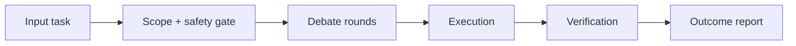

# 🧠 Mirror Council — Agent Runtime Architecture

## Architectural intent
This skill architecture is aligned to how an OpenClaw agent should execute this domain safely, with observable checkpoints and reversible actions.

## Agent execution flow

**Canonical flow:** Question -> Role split -> Debate rounds -> Consensus synthesis -> Decision package

## Core components
Internal role agents, structured debate, contradiction checks, weighted consensus.

## Control points (mandatory)
- Pre-check: validate scope, permissions, and policy constraints.
- Runtime-check: stop on suspicious or out-of-scope behavior.
- Post-check: verify objective completion + attach evidence.

## Error and rollback model
- On recoverable errors: retry with bounded policy.
- On high-risk or unknown states: fail-safe and require user confirmation.
- Always provide minimal rollback instructions in final output.

## Observability
- log key decisions (redacted)
- emit concise status (started/running/success/fail)
- include verification metrics when available
