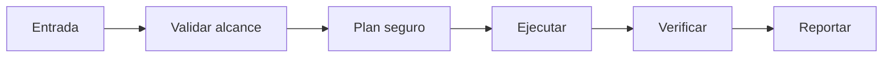

# 🧠 Mirror Council

<p align="center">
  
</p>

<p align="center">
  <a href="./README.md"></a>
  <a href="./README.es.md"></a>
</p>

## Resumen
Multi-agente interno para debate sin leaks: crea espejos con perspectivas diferentes y resuelve dilemas por consenso local.

## Instalación
```bash
git clone https://github.com/smouj/Mirror-Council.git
cd Mirror-Council
cat SKILL.es.md
```

## Arquitectura de entendimiento


## Estado
Iniciando

## Dificultad
Alta
