# 🧠 Mirror Council

<p align="center">
  
</p>

<p align="center">
  <a href="./README.md"></a>
  <a href="./README.es.md"></a>
</p>

<p align="center"><em>🧠 Consejo multi-agente interno.</em></p>

---

## Resumen
Framework de consejo interno multi-agente que permite debate, validación cruzada y consenso sin exponer datos sensibles a proveedores externos.

## Arquitectura de entendimiento

```mermaid
flowchart LR
  A[Objetivo de entrada] --> B[Chequeo de alcance]
  B --> C[Plan mínimo de pasos]
  C --> D[Ejecución segura]
  D --> E[Verificación]
  E --> F[Reporte + siguientes pasos]
```


## Instalación
```bash
git clone https://github.com/smouj/Mirror-Council.git
cd Mirror-Council
cat SKILL.es.md
```

## Uso rápido
```bash
printf "ejecutando mirror-council...\n"
```

## Estado
- Status: Iniciando
- Dificultad: Alta

## Roadmap
- [ ] Implementar lógica core v0
- [ ] Añadir tests de integración
- [ ] Publicar tag estable v1.0.0
