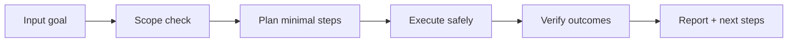

# 🧠 Mirror Council

<p align="center">
  
</p>

<p align="center">
  <a href="./README.md"></a>
  <a href="./README.es.md"></a>
</p>

<p align="center"><em>🧠 Consejo multi-agente interno.</em></p>

---

## Overview
Framework de consejo interno multi-agente que permite debate, validación cruzada y consenso sin exponer datos sensibles a proveedores externos.

## Architecture of understanding


## Installation
```bash
git clone https://github.com/smouj/Mirror-Council.git
cd Mirror-Council
# read the contract
cat SKILL.md
```

## Quick usage
```bash
# Example placeholder command
printf "running mirror-council...\n"
```

## Badges
- Status: Initiating
- Difficulty: Alta

## Roadmap
- [ ] Implement core logic v0
- [ ] Add integration tests
- [ ] Publish stable tag v1.0.0
